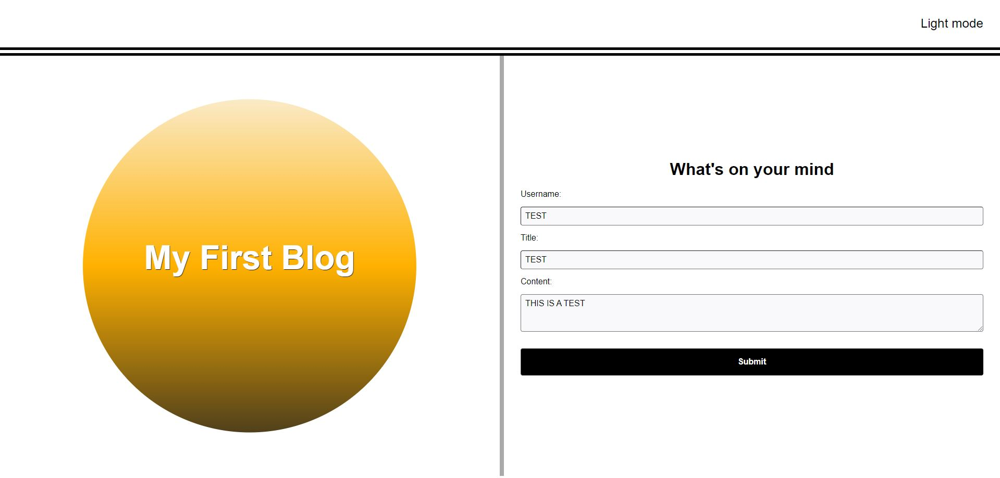
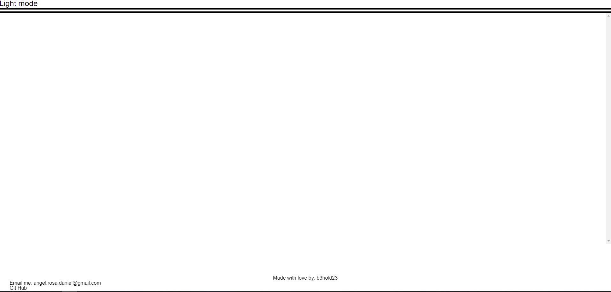
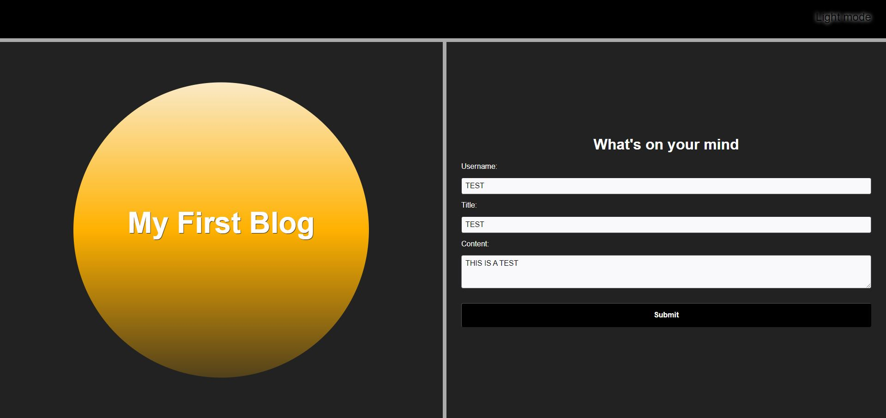

# blog-demo
<!-- Display site here -->

This site will help you journal and blog your stories. The site will first take your username, title of the content you are going to submit and then there is a box where you can put in your content. Once the infomation is input, you can press submit and you will be loaded to another page. In this page all of your information will be displayed. 

# Description 

The code to this site is not fullly complete. I have found my self with a CORS error that I will need to fix. Once that information is corrected the site will function correctly. 

The information you can see now are the following:

Form page where you can submit your information.

This is the blog page. Here is where the informaton should be displayed that was input in the form. 

The site also has the availablity to go into dark mode as well. 

